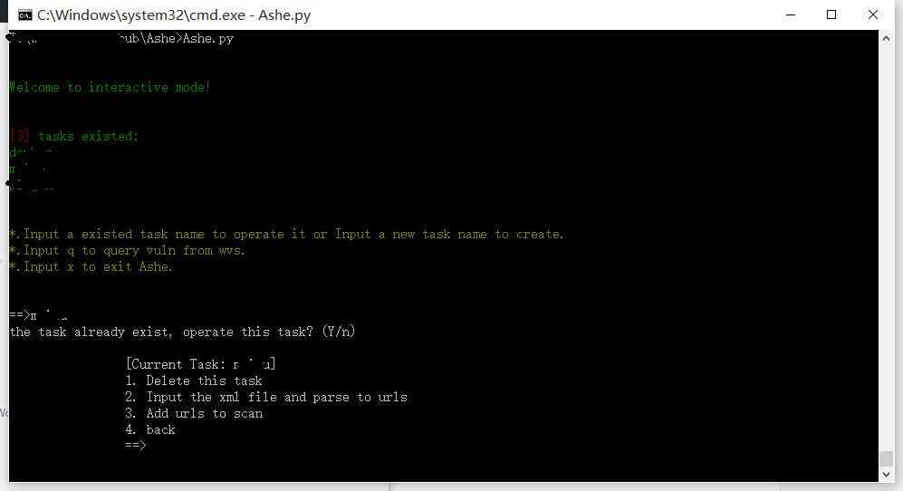

# Ashe

LOL中的艾希有个技能是万箭齐发，和多线程扫描很类似，故命名为艾希（Ashe）

### 描述：

该程序的主要功能是：

1. 解析nmap/masscan的扫描结构，从中提权所有可能的http或者https服务，组合成URL的形式。
2. 添加URL到WVS中进行扫描，目前主要使用WVS10.5， WVS11的代码还在编写中。
3. 操作WVS的数据库：删除没有漏洞的任务、查询所有高危漏洞、按照关键词查询某一类漏洞。

### 展示：

交互以shell式交互为主。

